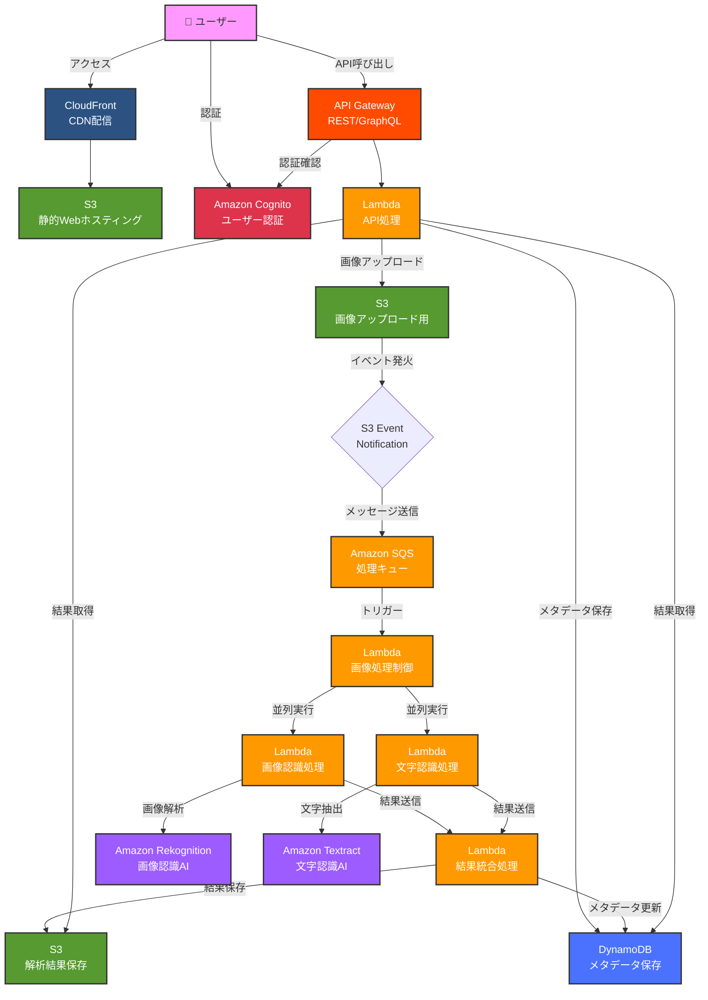

# サーバーレス画像解析プラットフォーム アーキテクチャ図

## 概要
アップロードした画像をAIで解析・分類するサーバーレスプラットフォーム

## 主な機能
- 画像認識 (Amazon Rekognition)
- 文字認識 (Amazon Textract)
- S3イベント駆動処理
- 非同期処理 (SQS + Lambda)
- REST/GraphQL API (API Gateway)

## アーキテクチャ図

## 処理フロー

1. **画像アップロード**
   - ユーザーがCloudFront経由でWebアプリケーションにアクセス
   - Cognitoで認証
   - API Gateway経由で画像をS3にアップロード

2. **イベント駆動処理**
   - S3イベント通知がSQSにメッセージを送信
   - SQSがLambda関数をトリガー

3. **並列AI処理**
   - Lambda関数が画像解析を並列実行
   - Rekognitionで画像内のオブジェクト、シーン、顔などを認識
   - Textractで画像内のテキストを抽出

4. **結果統合・保存**
   - 解析結果を統合してS3に保存
   - メタデータをDynamoDBに保存

5. **結果取得**
   - クライアントがAPI経由で解析結果を取得
   - リアルタイムで結果を表示

## 特徴

- **完全サーバーレス**: すべてのコンポーネントがマネージドサービス
- **スケーラブル**: 自動的にスケールし、大量の画像処理に対応
- **非同期処理**: SQSを使用した信頼性の高い非同期処理
- **並列処理**: 複数のAI機能を並列実行し、処理時間を短縮
- **セキュア**: Cognitoによる認証、IAMロールによる権限管理
- **コスト効率**: 使用した分だけの従量課金